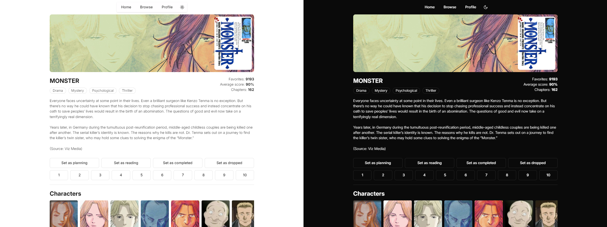

# SvelteKit Manga Browser
<div align="center">
    <div>
        
    </div>
    <details>
        <summary><b>Themes preview</b></summary>
        
    </details>
</div>

> [!WARNING]  
> The API used to fetch data has been in a degraded-state for quite a while. Because of this, requests are limited to **30 requests per minute** instead of it's original 90. The web application uses prefetching to simulate a performant website, but because of this, you can quite easily reach the rate limit. Be mindful of hovering over anything that could redirect you.
>
> *Note: for your convenience, the remaining rate limit gets logged into the console. With this you can also observe how the web application prefetches data.*

A full-stack web application for browsing and tracking manga using the AniList API. Built with SvelteKit, Drizzle ORM, and SQLite. Made for me to learn Svelte/SvelteKit (and it's ecosystem).

## Features

- Browse manga from AniList's database
- Search by title and filter by genre
- View detailed manga information including:
  - Cover art and banner images
  - Description
  - Statistics (favorites, score, chapters)
  - Character list
- Track your manga reading:
  - Mark as Planning/Reading/Completed/Dropped
  - Rate manga from 1-10
  - View your manga list in profile
- Theme support (light/dark)

## Tech stack

SvelteKit in itself isn't a full-stack framework, but making it one is very easy. In MVC context, SvelteKit only makes up the View and Controller aspects of it, but by adding Drizzle ORM you can easily create schemas and a database, meaning you have fulfilled the Model requirement of the MVC pattern.

- Svelte 5
- SvelteKit 2
- TypeScript
- Drizzle ORM
- SQLite
- TailwindCSS

## Setup

> [!IMPORTANT]  
> Make sure to seed the database. No user authentication was implemented because of time-constraints, so instead, one user gets seeded into the database and you are automatically "logged in" into this user. If you don't do this, then you won't be able to save manga to your list.

1. Clone the repository

2. Install dependencies:

```bash
npm install
```

3. Setup environment:

```bash
cp .env.example .env
```

4. Initialize database:

```bash
npm run db:push
```

5. Seed the database:

```bash
npm run db:seed
```

6. Start development server:

```bash
npm run dev
```

## API Rate Limiting

The AniList API has the following limitations:

- Normal rate: 90 requests/minute
- Current degraded state: 30 requests/minute
- Rate limit shown in X-RateLimit-Remaining header

Because of these limitations, the 50 most popular manga (aka the front page of the browsing tab) have been turned into mock data. If the user visits a manga which exists in the mock data, then it will load that instead of fetching to the public API.

For your convenience, the remaining rate limit gets logged into the console. With this you can also observe how the web application prefetches data.

## Miscellaneous notes

- No authentication implemented. Logged-in user is simulated using the first user record in the database (if you correctly seed the database (**do it**))
- Manga is NOT saved in the database. Fetches to the public API is made to get that data
- The manga_users table servers as a many-to-many relationship between manga and users, but like stated before, manga is not saved in the database so manga_id does not reference anything unlike user_id that does to the users table. This table exists to track your interaction with manga
- Local SQLite database persists user manga list entries
- Prefetching enabled for performance but may trigger rate limits
